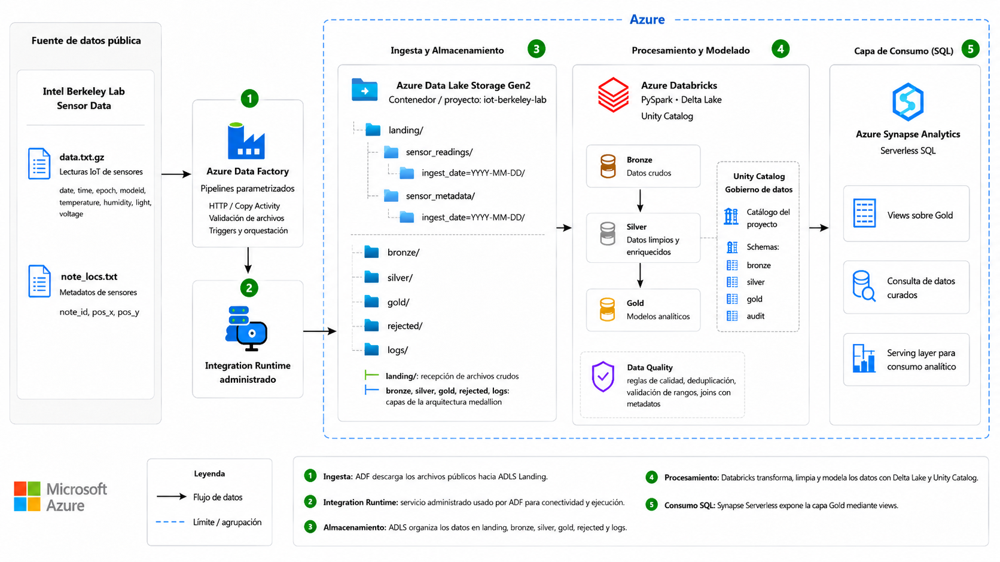

# Architecture

## High-Level Architecture



## Layer Responsibilities

### Source Layer

The project uses two public files from the Intel Berkeley Lab IoT dataset:

- `data.txt.gz`
- `mote_locs.txt`

### Ingestion Layer

Azure Data Factory copies the public files into the ADLS Gen2 landing zone as binary files. This preserves the original content and avoids applying transformations too early.

### Storage Layer

ADLS Gen2 organizes the data into the following zones:

```text
landing/
bronze/
silver/
gold/
rejected/
```

### Processing Layer

Azure Databricks uses PySpark and Delta Lake to implement the lakehouse flow:

```text
Landing → Bronze → Silver → Gold
```

### Serving Layer

Azure Synapse Analytics Serverless SQL reads the Gold Delta folders directly from ADLS Gen2 and exposes them through SQL views.

## Design Decisions

- ADF was intentionally limited to ingestion and basic landing validation.
- Databricks handles parsing, typing, validation, enrichment, and modeling.
- Bronze preserves raw records.
- Silver contains clean and enriched records.
- Gold contains analytics-ready dimensions and facts.
- Synapse Serverless SQL provides a lightweight SQL serving layer without copying data.
