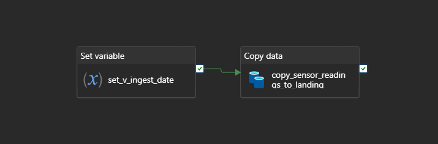
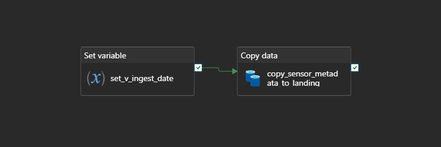
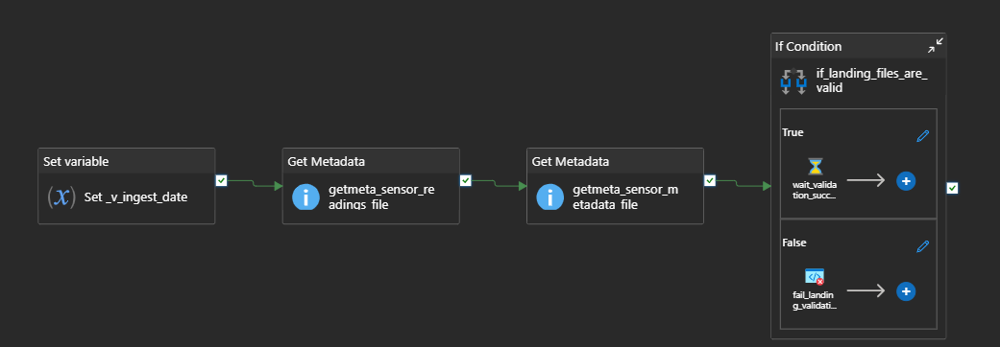
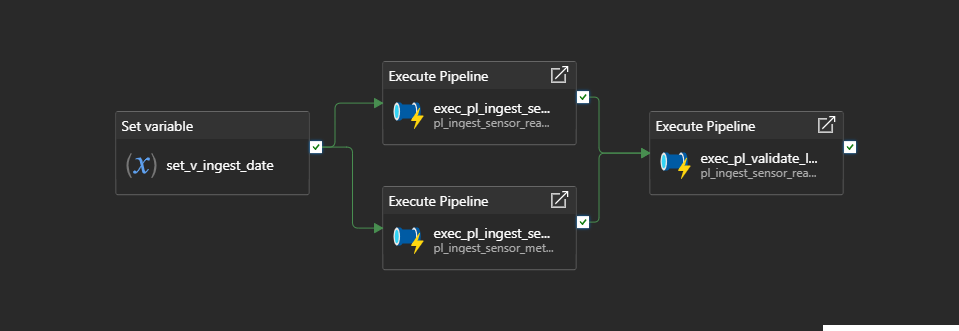

# Azure Data Factory Ingestion Layer

## Overview

Azure Data Factory was implemented as the ingestion and orchestration layer for the **Az-IOT-Berkeley — IoT Berkeley Lab Analytics Platform** project.

The goal of this phase was to move the raw Intel Berkeley Lab IoT files from a public HTTP source into Azure Data Lake Storage Gen2, while keeping the source files unchanged in the landing zone. ADF was intentionally limited to file ingestion, orchestration, and basic landing validation. No heavy transformations, schema parsing, or data cleansing were performed in ADF.

## Data Sources

Two public source files were ingested:

| Source File | Description |
| --- | --- |
| `data.txt.gz` | Main IoT sensor readings file from the Intel Berkeley Lab dataset. |
| `mote_locs.txt` | Sensor metadata file containing mote location information. |

The files were copied from the public HTTP source using a reusable HTTP linked service and a parameterized binary dataset.

## Design Approach

The ingestion process follows a raw file preservation approach:

```text
Public HTTP source
        ↓
Azure Data Factory
        ↓
ADLS Gen2 landing zone
```

ADF copies the files as binary objects. This ensures that the landing layer stores the original raw files without modifying their format, structure, or content.

This design keeps responsibilities clearly separated:

- ADF handles ingestion and basic validation.
- ADLS Gen2 stores the raw files in the landing zone.
- Downstream processing is responsible for parsing, cleansing, validation, and analytical modeling.

## Linked Services

Two linked services were created:

| Linked Service | Type | Purpose |
| --- | --- | --- |
| `ls_http_intel_berkeley_lab` | HTTP | Connects ADF to the public Intel Berkeley Lab source. |
| `ls_adls_iot_berkeley_lab` | Azure Data Lake Storage Gen2 | Connects ADF to the project Data Lake. |

The ADLS Gen2 linked service uses the Data Factory managed identity to access the storage account. The Data Factory identity was granted blob data access permissions on the storage account.

## Datasets

Two reusable parameterized binary datasets were created:

| Dataset | Type | Purpose |
| --- | --- | --- |
| `ds_http_binary_file_param` | HTTP Binary | Reads source files from HTTP using a dynamic relative URL. |
| `ds_adls_binary_file_param` | ADLS Gen2 Binary | Writes files to ADLS using dynamic file system, directory, and file name parameters. |

This avoided creating separate datasets for each source file and destination folder.

## Pipelines

The ADF ingestion workflow was implemented using the follow pipelines:

```text
pl_ingest_sensor_readings:
```



```text
pl_ingest_sensor_metadata:
```



```text
pl_validate_landing_files:
```



```text
pl_master_ingestion:
```




| Pipeline | Purpose |
| --- | --- |
| `pl_ingest_sensor_readings` | Copies `data.txt.gz` into the sensor readings landing folder. |
| `pl_ingest_sensor_metadata` | Copies `mote_locs.txt` into the sensor metadata landing folder. |
| `pl_validate_landing_files` | Validates that both files exist in ADLS and have a size greater than zero. |
| `pl_master_ingestion` | Orchestrates both ingestion pipelines and runs the landing validation pipeline. |

## Landing Zone Output

The files are written to ADLS Gen2 using an ingestion-date-based folder structure:

```text
landing/
├── sensor_readings/
│   └── ingest_date=YYYY-MM-DD/
│       └── data.txt.gz
└── sensor_metadata/
    └── ingest_date=YYYY-MM-DD/
        └── mote_locs.txt
```

The ingestion date can be provided manually through a pipeline parameter. If no date is provided, ADF automatically resolves the ingestion date using the current UTC date.

## Validation Logic

The validation pipeline uses Get Metadata activities to check both landing files.

The following checks are applied:

- The file exists.
- The file size is greater than zero.

If any validation fails, the pipeline raises a controlled failure using a Fail activity with a descriptive error message.

ADF does not validate the internal schema of the files because they are copied as binary files. Schema parsing and data quality validation are intentionally handled in the downstream processing layer.

## Final Status

The Azure Data Factory ingestion phase is complete.

Completed items:

- ADLS Gen2 linked service created and tested.
- HTTP linked service created and tested.
- Parameterized binary datasets created.
- Sensor readings ingestion pipeline created and tested.
- Sensor metadata ingestion pipeline created and tested.
- Landing validation pipeline created and tested.
- Master ingestion pipeline created and tested.
- Dynamic ingestion date handling fixed and validated.
- Basic error handling implemented and tested.